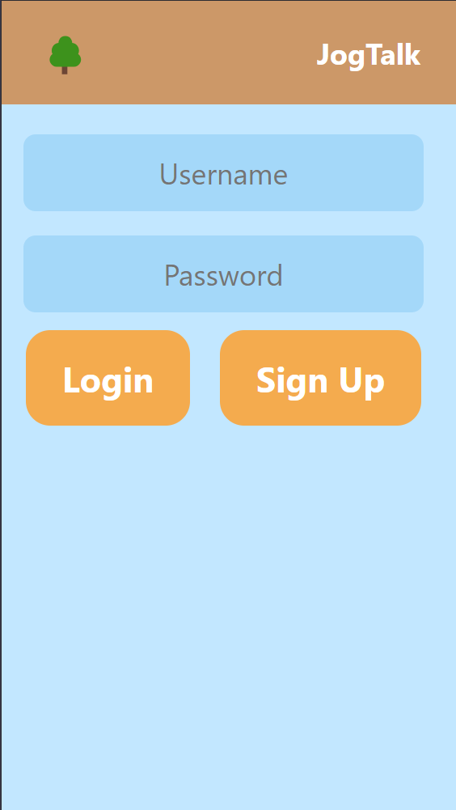
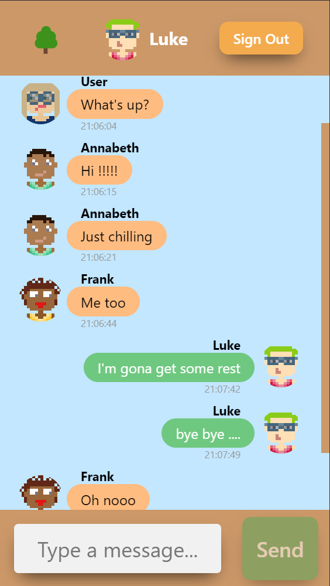
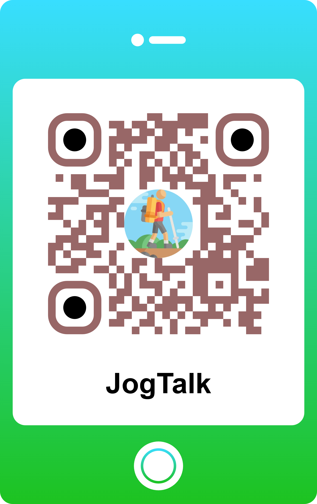

<a name="readme-top"></a>

### [Matteo Leopizzi](https://github.com/Rigor64) 326110

<!-- LOGO -->
<br />
<div align="center">
    

  <h1 align="center">JogTalk</h1>
  <h3 align="center">A decentralized chat app for your journey</h3>

</div>

<!-- Content tabel -->
<details>
  <summary>Content</summary>
  <ol>
    <li>
      <a href="#overview">Overview</a>
    </li>
    <li>
      <a href="#project-specifications">Project specifications</a>
      <ul>
        <li>Decentralized Database</li>
        <li>Message Transmission and Encryption</li>
        <li>User interface</li>
        <li>Accessibility and Usage</li>
      </ul>
    </li>
    <li>
      <a href="#protocol-description">Protocol description</a>
      <ul>
        <li>Data structure</li>
        <li>Real-time Updates and Synchronization</li>
        <li>Conflict Resolution</li>
        <li>Message Passing</li>
        <li>Main Operations</li>
      </ul>
    </li>
    <li>
      <a href="#design-choices">Design choices</a>
    </li>
    <li>
      <a href="#installation">Installation</a>
    </li>
  </ol>
</details>

<!-- OVERVIEW -->
## Overview
`JogTalk` is a unique chat app designed to help you to connect with others while you're out jogging or walking. Simply scan one of our specially designed QR codes with your device, that you can find around the entrances of parks, open fields, or at the beginning of a trail, and you'll be directed to our web service where the app runs seamlessly. Once logged in, you can join a global chat where users can share experiences, give feedback, and motivate each other. The goal of `JogTalk` is to promote outdoor activities and encourage people to engage with others nearby who are in the same location. Whether you're looking for a jogging partner, seeking motivation, or just want to share your journey, JogTalk makes your outdoor experience more interactive and enjoyable. Get moving and start chatting with `JogTalk`!

<br />
<div align="center">
    
    
</div>
<br />

<p align="right">(<a href="#readme-top">Back on top</a>)</p>

<!-- PROJECT SPECITIFATIONS -->
## Project specifications
<!-- DECENTRALIZED DATABASE -->
1. **Decentralized Database:**
   - JogTalk utilizes a decentralized database architecture to store user messages. This ensures that no single device holds the entire database, enhancing data security and redundancy.
   - Each user maintains a portion of the database on their device. The database is continuously synchronized, allowing for real-time updates and seamless communication.
   - Whenever the user turns off the application, all of the data stored in its device are eliminated.
   - The decentralized nature of the database reduces the risk of data breaches and provides resilience against server outages.

<!-- MESSAGE TRANSTISSION AND ENCRYPTION -->
2. **Message Transmission and Encryption:**
   - The app employs the `GUN` protocol, a decentralized networking protocol written in JavaScript, for both message transmission and encryption.
   - GUN ensures secure and efficient data distribution across all users, maintaining data integrity and privacy.
   - Messages are encrypted end-to-end, ensuring that user communication remains private and secure.
   - When create a new user account, the system generate a public/private key pair.
   - The login to the account is secured by hashing the password and a salt with PBKDF2. This produces a proof of work that is used to encrypt and decrypt the private key with AES.
   - With the private key, every user can read and write their own personal data using the private key as an `AES` encryption key.
   - With the public key, every user can sign their published content, to ensure the integrity.

<!-- USER INTERFACE -->
3. **User Interface:**
   - The graphical user interface (GUI) is developed using `HTML` and `CSS`, ensuring cross-device compatibility. This allows the application to be accessed through any device equipped with a web browser.
   - The interface is designed to be user-friendly and responsive, providing an optimal user experience regardless of the device used.

<!-- ACCESSIBILITY AND USAGE -->
4. **Accessibility and Usage:**
   - Users can join a global chat upon logging in, where they can share experiences, provide feedback, and encourage each other.
   - The `QR code` system simplifies access to the app, making it easy for users to connect and interact without the need for complex setup procedures.
   
<br>
<div align="center">

</div>
</br>

<p align="right">(<a href="#readme-top">Back on top</a>)</p>

<!-- PROTOCOL DESCRIPTION -->
## Protocol description

[GUN](https://gun.eco/) is a small, easy, and fast protocol for syncing data. `GUN` is a database engine that runs every­where JavaScript does browsers, mo­bile de­vices and servers, al­low­ing you to build ex­act­ly the data sys­tem you want. `GUN.JS` aka `GunDB` is more than just a graph database. `GUN` is fully decentralized (peer-to-peer or multi-master), changes are not controlled by a centralized server. A server can be just another peer (node or vertices) in the network, one that may have more reliable resources than a browser. You save data on one machine, and it will sync it to other peers without needing a complex consensus protocol. GUN allows for data synchronization to happen seamlessly between all connected nodes by default. It’s offline first capabilities mean that if connectivity is lost to other nodes due to a network error or no availability, the application will store all changes locally and automatically synchronize as soon there is a connection. The gun graph database is stored across all peers participating in the network. Most data distribution scenarios that one could think of are possible to occur: every peer might possess the complete graph, or only a subset of the complete graph and may possess data that does not exist on any other node. The whole database is considered to be the union of all peers’ graphs.

1. **Data structure**
   - Graph Data Model: `GUN.js` stores data in a graph format, which allows for flexible, hierarchical, and interconnected data.
   - Nodes and Edges: Each piece of data (node) is connected via edges (relationships) to other nodes, making it easy to represent complex data structures.

2. **Real-time Updates and Synchronization**
   - Pub/Sub Mechanism: `GUN.js` uses a publish/subscribe model to propagate updates. When data changes on one node, the update is published to all subscribed nodes.
   - Delta-based Updates: Instead of sending the entire dataset, GUN.js sends only the changes (deltas). This reduces bandwidth usage and speeds up synchronization.
     
3. **Conflict Resolution**
   - CRDTs: `GUN.js` employs Conflict-Free Replicated Data Types (CRDTs) to handle conflicts automatically. CRDTs ensure that all nodes converge to the same state eventually, even if updates occur in different orders.
   - Timestamps and Lexical IDs: Each update is timestamped, and `GUN.js` uses lexical IDs to order operations. This helps in determining the most recent update and resolving conflicts deterministically.
     
4. **Message Passing**
   - Operation Type: (e.g., put, get, ack)
   - Message paradigm: The message object contain the parameters `who` (the user's name),`what` (the message),`when` (timestamp)
   - Transport Layer: `GUN.js` supports multiple transport layers, such as WebSockets, HTTP, and peer-to-peer connections. This flexibility allows it to operate in various network conditions.

5. **Main Operations**
   - Local Cache: `GUN.js` maintains a local cache to ensure the application works offline. Changes made while offline are stored locally and synced once the connection is restored.
   - Reconciliation: When reconnecting, `GUN.js` reconciles local changes with the remote state using `CRDTs`, ensuring consistency without data loss.
   - Anti-Entropy Mechanism: `GUN.js` uses an anti-entropy mechanism to periodically exchange state information between nodes. This ensures that even if some updates are missed, nodes will eventually converge to the same state.
      
[GitHub on the project](https://github.com/amark/gun)

<p align="right">(<a href="#readme-top">Back on top</a>)</p>

<!-- INSTALLATION -->
## Design choices
- The master key for the end-to-end encryption of the messages is: `rG.k4FALy-TB_gF`
- All the users are connected to the same chat
- Languages used: `Javascript`, `HTML`, `CSS`, `Svelte` (a simple way to make html and javascript communicate with each other)
  
<p align="right">(<a href="#readme-top">Back on top</a>)</p>

<!-- INSTALLATION -->
## Installation
If you want to try the local version of the project, you just need to open a `PowerShell` prompt and type:

```
git clone https://github.com/Rigor64/gun-chat
npm install
npm run dev
```

<p align="right">(<a href="#readme-top">Back on top</a>)</p>

